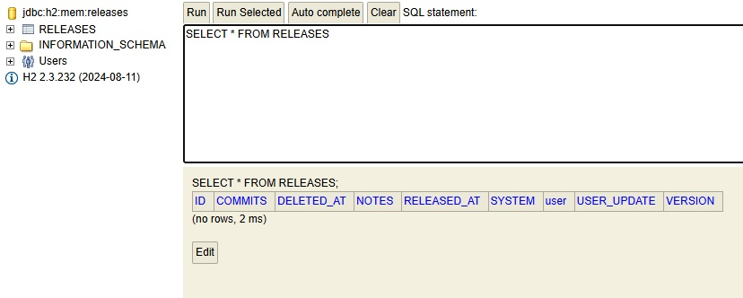
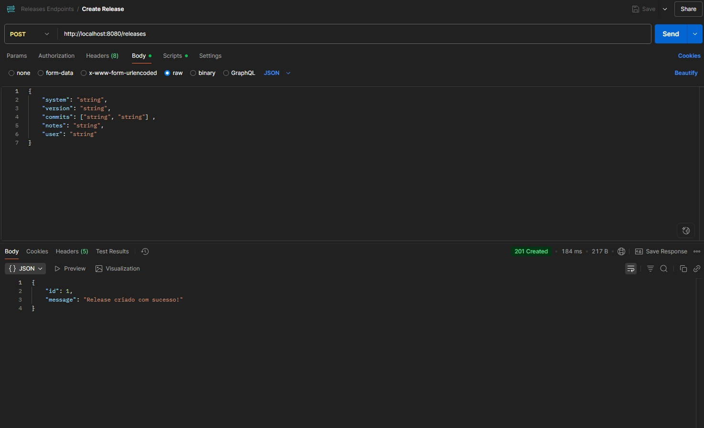
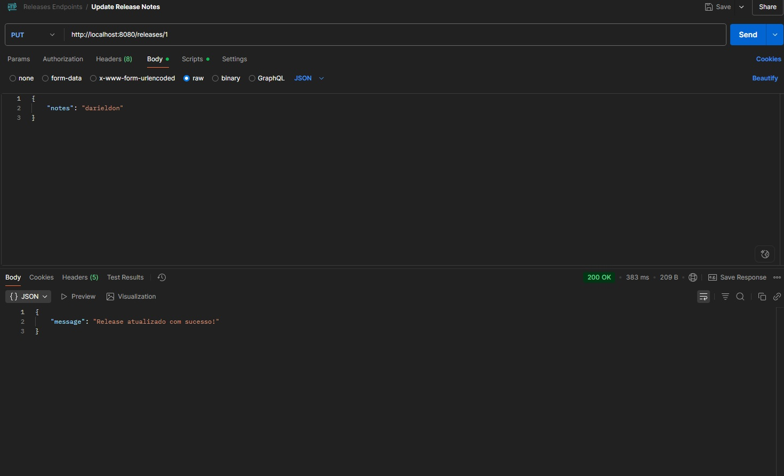
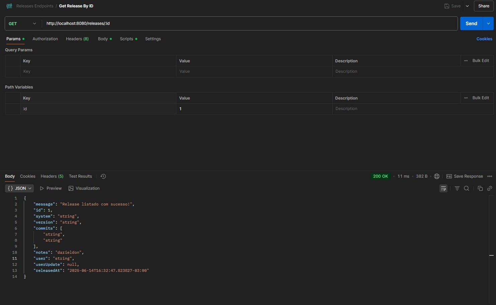
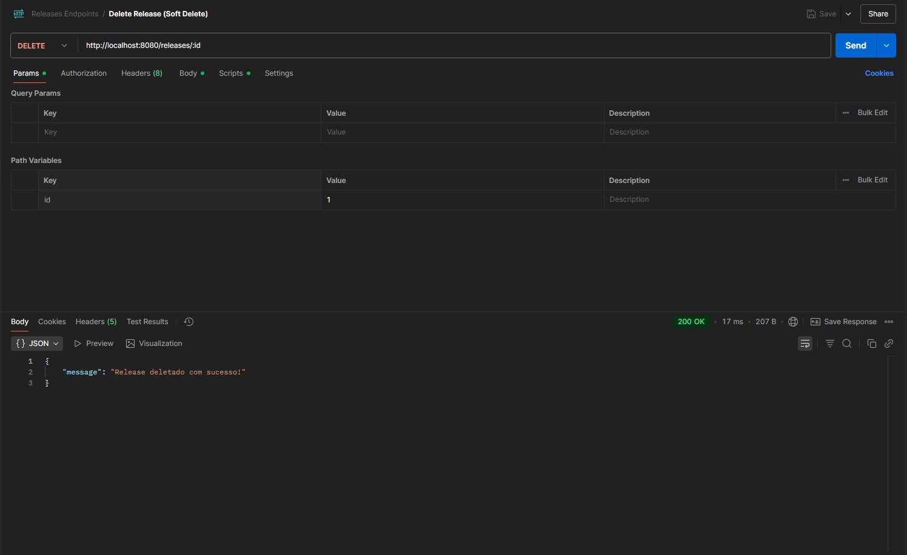
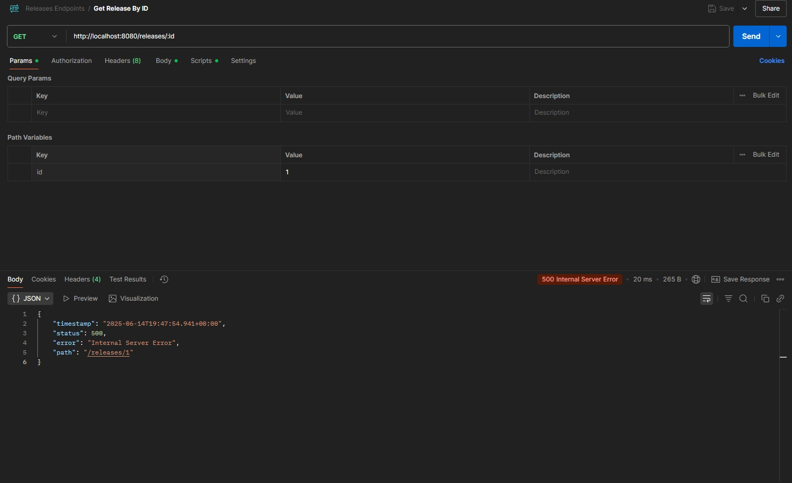
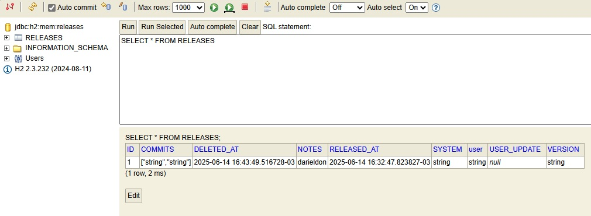

# 🧪 Avaliação Técnica – Desenvolvedor(a) Backend Pleno (Java + Spring)

## 📝 Objetivo

Criar uma API REST para gerenciamento de releases de sistemas. A API deverá ser desenvolvida utilizando **Java** com **Spring Boot**. seguindo as especificações abaixo.

## 🗃️ Modelo de Dados

Crie uma tabela chamada `releases`
utilizando o banco de dados H2, com o seguintes campos:

|   Campo    |     Tipo      |         Observações          |
| :--------: | :-----------: | :--------------------------: |
|     id     | autoIncrement |        Chave primária        |
|   system   | String (255)  | Trim automático, obrigatório |
|  version   |  String (30)  |         Obrigatório          |
|  commits   |  Json/Array   |  Lista de commits (strings)  |
|   notes    |     Text      |           Opcional           |
|    user    | String (100)  |         Obrigatório          |
| userUpdate | String (100)  |  Deve ser extraído do token  |
| releasedAt |   DateTime    |  Data de criação automática  |
| deletedAt  |   DateTime    |   Usado para "soft delete"   |

### Explicação da Tabela

Para criar a tabela `releases` no banco de dados H2 foi criada a classe [`ReleaseEntity.java`](https://github.com/DarieldonMedeiros/DesafioSpringBoot/blob/main/src/main/java/com/zipdin/avaliacao/entities/ReleaseEntity.java) na pasta entities. As configurações do banco de dados H2 estão no arquivo [`application.yml`](https://github.com/DarieldonMedeiros/DesafioSpringBoot/blob/main/src/main/resources/application.yml) e quando o código é executado, gera a seguinte tabela sem dados no seguinte link: http://localhost:8080/h2-console.



<center><b>Tabela Criada no banco H2</b></center>

Como a coluna commits no arquivo `ReleaseEntity` é um `List<String>`, logo foi necessário criar uma classe com o seguinte nome: [`StringListConverter.java`](https://github.com/DarieldonMedeiros/DesafioSpringBoot/blob/main/src/main/java/com/zipdin/avaliacao/services/StringListConverter.java), que faz a conversão de um `List<String>` para `String` e vice-versa para que a coluna de commits apareça na tabela `releases`.

## 📍Endpoints

### 🔷 **Create Release**

`POST /releases`

**Request Body:**

```Json
{
    "system": "string",
    "version": "string",
    "commits": ["string", "string"],
    "notes": "string",
    "user": "string"
}
```

**Response:**

```Json
{
    "id": 1,
    "message": "Release criado com sucesso!"
}
```

#### Solução POST

A utilização da classe [`ReleaseController.java`](https://github.com/DarieldonMedeiros/DesafioSpringBoot/blob/main/src/main/java/com/zipdin/avaliacao/controller/ReleaseController.java) junto da utilização do aplicativo <a href="https://www.postman.com/downloads/" target="_blank"></a> que é onde de fato é feita a requisição de criação do release. Logo abaixo são mostrados o código da requisição POST e a imagem do aplicativo Postman.

```Java
    @PostMapping
    public ResponseEntity<Object> createRelease(@RequestBody @Valid ReleaseDTO releaseDTO){
        var releaseEntity = new ReleaseEntity();
        BeanUtils.copyProperties(releaseDTO, releaseEntity);
        releaseEntity.setReleasedAt(LocalDateTime.now());
        var savedRelease = releaseServices.saveRelease(releaseEntity);

        // Montando a resposta
        Map<String, Object> response = new HashMap<>();
        response.put("id", savedRelease.getId());
        response.put("message", "Release criado com sucesso!");

        return ResponseEntity.status(HttpStatus.CREATED).body(response);
    }
```



<center><b>Endoint POST</b></center>

### 🔷 **Get Release by ID**

`GET /releases/{id}`

**Response:**

```Json
{
  "message": "Release listado com sucesso.",
  "id": 1,
  "system": "string",
  "version": "string",
  "commits": ["string", "string"],
  "notes": "string",
  "user": "string",
  "userUpdate": "string",
  "releasedAt": "2025-05-26T14:00:00Z"
}
```

#### Solução GET

Da mesma forma que foi feito acima no endpoint POST, logo abaixo será mostrado o código do endpoint GET, assim como a imagem da requisição feita no Postman.

```Java
    @GetMapping("/{id}")
    public ResponseEntity<ReleaseResponseDTO> getReleaseByID(@PathVariable(value = "id") Long id){
        Optional<ReleaseEntity> releaseEntityOptional = releaseServices.findById(id);
        if (releaseEntityOptional.isEmpty()) {
            return ResponseEntity.status(HttpStatus.NOT_FOUND).body(null);
        }
        ReleaseEntity releaseEntity = releaseEntityOptional.get();
        ReleaseResponseDTO releaseResponseDTO = new ReleaseResponseDTO(
            "Release listado com sucesso!",
            releaseEntity.getId(),
            releaseEntity.getSystem(),
            releaseEntity.getVersion(),
            releaseEntity.getCommits(),
            releaseEntity.getNotes(),
            releaseEntity.getUser(),
            releaseEntity.getUserUpdate(),
            releaseEntity.getReleasedAt()
        );

        return ResponseEntity.status(HttpStatus.OK).body(releaseResponseDTO);
    }
```


<center><b>Endoint GET</b></center>

### 🔷 **Update Release Notes**

`PUT /releases/{id}`

**Request Body:**

```Json
{
    "notes": "string"
}
```

**Response:**

```Json
{
    "message": "Release atualizado com sucesso!"
}
```

#### Solução PUT

Seguindo o mesmo padrão, logo abaixo tem o código da requisição PUT e a imagem da requisição no Postman, além de uma requisição GET, mostrando que de fato houve a mudança do valor em `notes`.

```Java
    @PutMapping("/{id}")
    public ResponseEntity<Object> updateReleaseNotes(@PathVariable(value = "id") Long id, @RequestBody @Valid UpdateNotesDTO updateNotesDTO) {
        releaseServices.updateReleaseNotes(id, updateNotesDTO);
        GenericResponseDTO response = new GenericResponseDTO("Release atualizado com sucesso!");
        return ResponseEntity.status(HttpStatus.OK).body(response);
    }
```



<center><b>Endoint PUT</b></center>
<br>



<center><b>Endoint GET de Verificação</b></center>

### 🔷 **Delete Release (Soft Delete)**

`DELETE /releases/{id}`

**Response:**

```Json
{
    "message":"Release deletado com sucesso!"
}
```

#### Solução DELETE

Assim como foi feito nos itens anteriores, será mostrado o código responsável pelo delete, a imagem da requisição feita no Postman, a requisição GET não conseguindo acessar o item deletado e além disso será mostrada a imagem no banco H2 mostrando que de fato o item ainda se encontra na tabela, porém a informação deleted_at encontra-se preenchida.

```Java
    @DeleteMapping("/{id}")
    public ResponseEntity<Object> deleteRelease(@PathVariable(value = "id") Long id){
        releaseServices.deleteRelease(id);
        GenericResponseDTO response = new GenericResponseDTO("Release deletado com sucesso!");
        return ResponseEntity.status(HttpStatus.OK).body(response);
    }
```



<center><b>Endoint DELETE</b></center>
<br>



<center><b>Endoint GET não conseguindo acessar o id 1</b></center>
<br>



<center><b>Tabela no banco H2 mostrando que o id ainda se encontra </b></center>

## ✅ Requisitos Técnicos

- Java 17+ com Spring Boot: **_(Foi utilizado o Java 17 nesta avaliação) ✅_**
- Persistência com JPA: **_Implementado com sucesso! ✅_**
- Commit da prova em repositório Git público ou zip: **_Implementado com sucesso! ✅_**
- Autenticação JWT (mockada ou simples): **_Pendente❌_**
- Tratamento de erros e validações: **_Pendente❌_**
- Swagger ou documentação de endpoints: **_Pendente❌_**

## 🔧 Pontos Bônus (não obrigatórios)

- Criar paginação e filtros de pesquisa nas APIs de listagem: **_Implementado com sucesso a parte de paginação através do Get All! ✅_**
- Criar um dockerfile para a aplicação, que permita a fácil construção de uma imagem Docker da aplicação: **_Pendente❌_**
